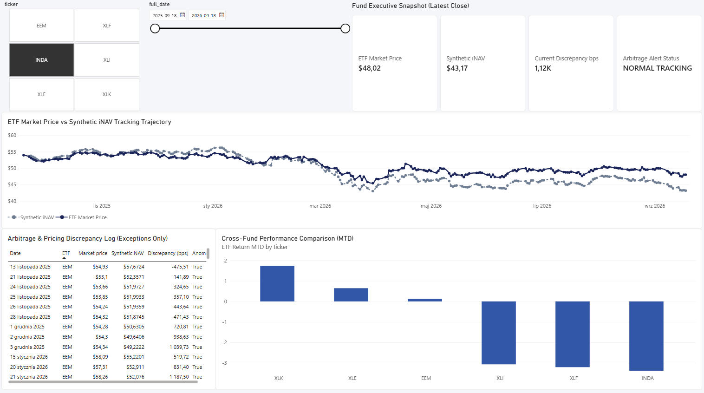
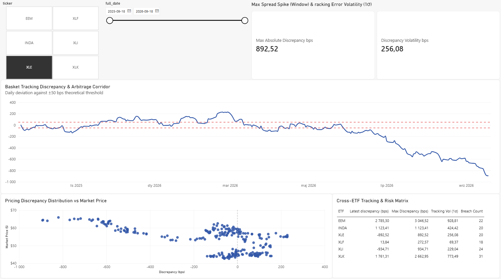
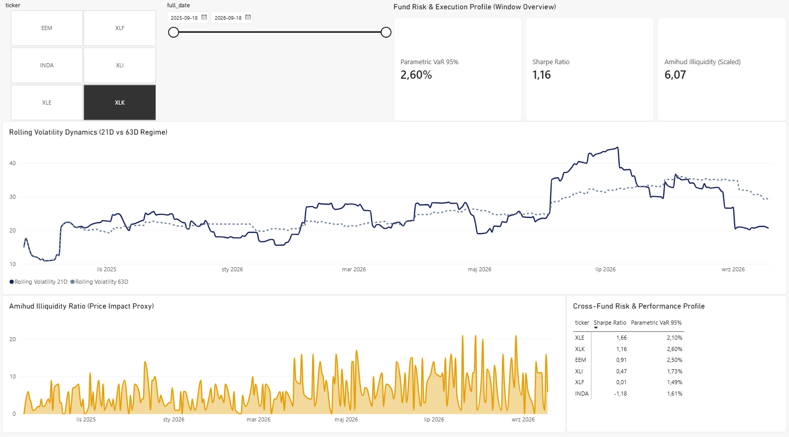

# ETF Valuation & Liquidity Arbitrage Engine (NavGuard)

[](https://github.com/filip-jastrzebski/etf-valuation-liquidity-engine/actions/workflows/ci.yml)
[](https://www.python.org/downloads/release/python-3110/)
[](https://opensource.org/licenses/MIT)
[](https://github.com/astral-sh/ruff)

End-to-end quantitative data platform and fund accounting oversight engine designed to calculate daily synthetic net asset value ($\text{iNAV}$ proxies), monitor end-of-day arbitrage dislocations, tracking dynamics, and market microstructure liquidity risks across single-currency and multi-currency exchange-traded funds.

The platform continuously consumes multi-asset OHLCV market feeds and benchmark rates, executes vectorized cross-market valuations using a Divisor index model with calendar forward-fills, quarantines data anomalies, pushes windowed statistical computations directly into PostgreSQL, and exposes a star-schema model to Power BI for institutional risk reporting.

## 1. System Architecture

```text
   ┌─────────────────────────────────────────────────────────────┐
   │                       DATA SOURCES                          │
   │      Yahoo Finance API (Equities, FX Pairs & Macro Rates)   │
   │      (OHLCV, USD Parities, Treasury Benchmarks e.g. ^IRX)   │
   └──────────────────────────────┬──────────────────────────────┘
                                  │
                                  ▼
   ┌─────────────────────────────────────────────────────────────┐
   │               INGESTION & DATA QUALITY LAYER                │
   │   src/ingestion/market_data.py | src/quality/validators.py  │
   │   • Structural Basket Integrity (Weights = 1.0, Duplicates) │
   │   • Market Feeds: OHLC Consistency, Non-Negative, Swings    │
   └──────────────┬───────────────────────────────┬──────────────┘
                  │ Clean Records                 │ Quarantined (JSONB)
                  ▼                               ▼
   ┌──────────────────────────────┐ ┌────────────────────────────┐
   │  STAR SCHEMA (PostgreSQL 15) │ │    DATA QUARANTINE LOG     │
   │  • dim_date                  │ │    fact_data_quarantine    │
   │  • dim_security              │ └────────────────────────────┘
   │  • dim_etf_basket            │
   │  • fact_market_prices        │
   │  • fact_macro_rates          │
   └──────────────┬───────────────┘
                  │
                  ▼
   ┌─────────────────────────────────────────────────────────────┐
   │               SYNTHETIC NAV & VALUATION ENGINE              │
   │   src/valuation/synthetic_nav.py                            │
   │   • FX Normalization (USD/Local currency parity)            │
   │   • Base Inception Divisor Synchronization                  │
   │   • Cross-Market Calendar Alignment (LOCF Forward-Fill)     │
   │   • Populates: fact_synthetic_nav                           │
   └──────────────┬──────────────────────────────────────────────┘
                  │
                  ▼
   ┌─────────────────────────────────────────────────────────────┐
   │                 ADVANCED SQL ANALYTICS LAYER                │
   │   sql/02_views_analytics.sql (view_etf_market_analytics)    │
   │   • Tracking Difference (TD) & 21D Tracking Error (TE)      │
   │   • 21D & 63D Annualized Rolling Volatility                 │
   │   • Amihud Illiquidity Ratio (Price Impact per $1M)         │
   │   • Statistical Dynamic Arbitrage Anomaly Detection         │
   └──────────────┬──────────────────────────────────────────────┘
                  │
                  ▼
   ┌─────────────────────────────────────────────────────────────┐
   │              POWER BI EXECUTIVE DASHBOARD                   │
   │   reports/nav_liquidity_dashboard.pbix                      │
   │   • 1: Executive / Oversight View                           │
   │   • 2: Basket Arbitrage & NAV Discrepancy                   │
   │   • 3: Fund Liquidity & Risk Analytics (Parametric/Hist VaR)│
   └─────────────────────────────────────────────────────────────┘
   ```

## 2. Quantitative & Valuation Methodology

### 2.1 Multi-Currency Synthetic iNAV

Because constituent equities trade in different jurisdictions with distinct local currencies, raw prices are converted into the fund’s reporting currency (USD) before computing the aggregate base index:

$$P_{i,t}^{\text{USD}} = \frac{P_{i,t}^{\text{local}}}{\text{FX}_{i,t}}$$

$$\text{Basket Value}_t = \sum_{i=1}^{N} \left( w_i \times P_{i,t}^{\text{USD}} \right)$$

Where $\text{FX}_{i,t} = 1.0$ for US equities and equals the exchange rate (e.g., KRW=X, INR=X) for overseas assets.

### 2.2. Divisor Normalization

To prevent scale distortions between the aggregate nominal constituent prices and the individual ETF share price, the engine calibrates a **baseline Divisor ($D$)** on inception date $t_0$:

$$D = \frac{\text{Basket Value}_{t_0}}{P_{\text{ETF}, t_0}}$$

For all subsequent dates $t > t_0$:

$$\text{iNAV}_t = \frac{\text{Basket Value}_t}{D} + \text{Cash Component}$$

### 2.3 Calendar Forward-Fill (Cross-Market Synchronization)

Emerging market funds (such as **EEM** or **INDA**) trade on US exchanges during dates when domestic underlying exchanges (e.g., NSE in Mumbai or TWSE in Taipei) observe local holidays. To eliminate false $2000\%+$ arbitrage spikes caused by missing constituent legs, the engine pivots holdings into a date-ticker matrix and applies Last Observation Carried Forward (`ffill()`) followed by back-fill (`bfill()`), holding stale closing prices constant until local trading resumes.

### 2.4 Arbitrage Discrepancy & Anomaly Detection

The pricing spread and basis point discrepancy are defined as:

$$\text{Spread}_t = P_{\text{ETF}, t} - \text{iNAV}_t$$

$$\text{Discrepancy (bps)}_t = \left( \frac{P_{\text{ETF}, t} - \text{iNAV}_t}{\text{iNAV}_t} \right) \times 10\,000$$

Anomalies are flagged using both:
1. **Engine Level:** Sample distribution dynamic cutoff $\vert{}Z\vert{} \ge 2.0\sigma$ with an absolute threshold minimum ($\vert{}BPS\vert{} \ge 30.0$).
2. **SQL Analytics Level:** Rolling 21-session windowed Z-Score:

$$Z_{t, 21} = \frac{\text{Discrepancy}_t - \mu_{t, 21}}{\sigma_{t, 21}} \ge 2.0$$

### 2.5 Risk & Market Microstructure Formulas

* **Tracking Difference (TD):**

$$\text{TD}_t = R_{\text{ETF}, t} - R_{\text{iNAV}, t}$$

* **Tracking Error (Annualized TE):**

$$\text{TE}_{21\text{d}} = \sigma(\text{TD}_{t-20:t}) \times \sqrt{252} \times 10\,000 \quad \text{[bps]}$$

* **Amihud Illiquidity Ratio (USD 1M Turnover):**

$$\text{ILLIQ}_t = \frac{|R_{\text{ETF}, t}| \times 1\,000\,000}{P_{\text{close}, t} \times \text{Volume}_t}$$

* **Parametric Value at Risk ($\text{VaR}_{95\%}$):**

$$\text{VaR}_{95\%} = -(\mu - 1.645 \times \sigma)$$

* **Annualized Sharpe Ratio:**

$$\text{Sharpe} = \frac{\overline{R}_{\text{ETF}} - \overline{R}_f}{\sigma(R_{\text{ETF}})} \times \sqrt{252}$$

## 3. Fund Accounting & Market Structure Glossary

* **Authorized Participant (AP):** An institutional market maker or broker-dealer with the contractual right to create and redeem ETF shares directly with the fund sponsor in creation units (typically 25,000 to 100,000 shares).

* **Creation / Redemption Basket:** The specific portfolio of underlying securities (and cash equivalent) that an AP must deposit to receive new ETF shares (creation) or that the AP receives in exchange for tendering ETF shares (redemption). This in-kind exchange mechanism prevents taxable capital gains within the fund structure.

* **Arbitrage Mechanism (No-Arbitrage Band):**

    * **ETF trading at Premium ($P_{\text{ETF}} > \text{iNAV}$):** APs short-sell the overvalued ETF shares on the exchange, purchase the underlying basket at market, and exchange the basket with the fund sponsor for new shares to close out the short position.
    
    * **ETF trading at Discount ($P_{\text{ETF}} < \text{iNAV}$):** APs buy the undervalued ETF shares on the exchange, redeem them with the fund sponsor for the underlying basket, and sell the underlying shares on the open market.

* **Stale Pricing:** A discrepancy between $P_{\text{ETF}}$ and $\text{iNAV}$ that occurs because constituent markets in Asia or Europe have closed while the US-listed ETF continues trading on US macro sentiment and headline news.

## 4. Universe Coverage

The system monitors 6 representative funds covering distinct market microstructures and volatility regimes over a full 251 trading-day window:

| Ticker | Fund Name | Asset Focus | Constituent Currency | Primary Market Structure |
| :--- | :--- | :--- | :--- | :--- |
| **XLF** | Financial Select Sector SPDR | US Financials | USD | High Liquidity / Large Cap |
| **XLK** | Technology Select Sector SPDR | US Technology | USD | High Beta / Sector Concentration |
| **XLE** | Energy Select Sector SPDR | US Energy | USD | Commodity Sensitivity / Volatile |
| **XLI** | Industrial Select Sector SPDR | US Industrials | USD | Cyclical Equities |
| **INDA** | iShares MSCI India ETF | Indian Equities | INR | Emerging Market / Cross-Calendar |
| **EEM** | iShares MSCI Emerging Markets | Global EM Equities | TWD, HKD, KRW, USD | Multi-Currency / Stale Price Regimes |

## 5. Database Model (Star Schema)

The database strictly enforces financial data validation rules through PostgreSQL constraints (CHECK, UNIQUE, FOREIGN KEY):

```text
                      ┌───────────────┐
                      │   dim_date    │
                      ├───────────────┤
                      │PK date_id     │
                      │   full_date   │
                      │   is_trading  │
                      └───────┬───────┘
                              │
          ┌───────────────────┼───────────────────┐
          │                   │                   │
          ▼                   ▼                   ▼
┌───────────────────┐ ┌───────────────┐ ┌───────────────────┐
│fact_market_prices │ │fact_macro_rate│ │fact_synthetic_nav │
├───────────────────┤ ├───────────────┤ ├───────────────────┤
│PK price_id        │ │PK rate_id     │ │PK nav_id          │
│FK security_id     │ │FK date_id     │ │FK etf_security_id │
│FK date_id         │ │   risk_free_rt│ │FK date_id         │
│   open, high, low │ └───────────────┘ │   etf_market_price│
│   close_price     │                   │   synthetic_nav   │
│   volume          │                   │   discrepancy_bps │
└─────────▲─────────┘                   │   is_anomaly      │
          │                             └─────────▲─────────┘
          │                                       │
          └───────────────────┬───────────────────┘
                              │
                      ┌───────┴───────┐
                      │ dim_security  │
                      ├───────────────┤
                      │PK security_id │
                      │   ticker      │
                      │   asset_class │
                      │   currency    │
                      └───────▲───────┘
                              │
                      ┌───────┴───────┐
                      │dim_etf_basket │
                      ├───────────────┤
                      │PK basket_id   │
                      │FK etf_sec_id  │
                      │FK comp_sec_id │
                      │   weight      │
                      └───────────────┘
```

* **fact_data_quarantine:** Fully isolated table capturing rejected rows during ingestion (e.g., negative volume, inverted OHLC thresholds, or basket weights $\ne 1.0$) formatted as structured JSONB payloads with explicit error codes.

## 6. Executive Reporting (Power BI)

The analytical engine feeds an institutional three-page Power BI executive suite designed for risk controllers, portfolio managers, and ETF execution traders:

### Page 1: Executive Oversight & Quality Gating

Executive-level portfolio health, real-time data quarantine alerts, and cross-fund discrepancy tracking.



### Page 2: Basket Arbitrage & Synthetic NAV Dynamics

Deep dive into $P_{\text{ETF}}$ vs $\text{iNAV}$ basis point dislocations, statistical $Z$-score bands, and no-arbitrage boundary conditions.



### Page 3: Market Liquidity & Microstructure Risk

Execution slippage modeling via the Amihud Illiquidity Ratio (USD 1M price impact), parametric vs historical Value at Risk ($\text{VaR}_{95\%}$), and rolling tracking error regimes.



## 7. Setup & Execution (3-Step Quickstart)

The repository includes a deterministic pre-seeded database dump (sql/03_seed_data.sql). No API keys or long historical data downloads are required to run the environment.

### Prerequisites

* Docker Desktop installed and running.

* Power BI Desktop (Windows) to view reports.

### Step 1: Clone Repository

```bash
git clone https://github.com/filip-jastrzebski/etf-valuation-liquidity-engine.git
cd etf-valuation-liquidity-engine
```

### Step 2: Spin Up Infrastructure

```bash
docker compose up -d db
```

PostgreSQL spins up, builds the schema, mounts views, and auto-populates all ~35,000 historical price and synthetic valuation records from 03_seed_data.sql.

### Step 3: Open Dashboard

1. Launch Power BI Desktop.

2. Open powerbi/nav_liquidity_dashboard.pbix.

3. Hit Refresh on the Home ribbon to pull live data from localhost:5432.

## 8. Pipeline Re-Execution & Testing

If you wish to re-ingest market feeds from scratch or run the analytical suite locally:

```bash
# 1. Prepare environment
python -m venv .venv
source .venv/bin/activate  # Windows: .venv\Scripts\activate
pip install -r requirements.txt

# 2. Run market and macroeconomic data pipelines
python -m src.ingestion.market_data
python -m src.ingestion.macro_data

# 3. Trigger synthetic NAV calculation engine
python -m src.valuation.synthetic_nav

# 4. Execute test suite
pytest tests/ -v
```

## 9. Repository Structure

```text
etf-valuation-liquidity-engine/
├── .github/workflows/ci.yml       # Automated GitHub Actions test workflow
├── config/                        # Instrument & Macro configurations
│   ├── basket_definitions.json    # Constituent weights, currencies & sectors
│   └── macro_definitions.json     # Benchmark reference definitions
├── docs/                          # Images used for visualisation in README
│   └── images/
│       ├── 01_executive_oversight.png
│       ├── 02_basket_arbitrage.png
│       └── 03_liquidity_risk.png
├── powerbi/                       # Analytics & Reporting
│   └── nav_liquidity_dashboard.pbix # 3-page Power BI executive report
├── sql/                           # Database lifecycle & migration DDL
│   ├── 01_init_schema.sql         # Star-schema tables & constraints
│   ├── 02_views_analytics.sql     # Windowed quant calculations view
│   └── 03_seed_data.sql           # Pre-calculated zero-dependency dataset
├── src/                           # Core Engine Modules
│   ├── db/
│   │   └── connection.py          # SQLAlchemy connection pool
│   ├── ingestion/                 # Pipeline loaders via yfinance
│   │   ├── macro_data.py          # Macro benchmarks ingestion
│   │   └── market_data.py         # Multi-asset OHLCV & FX ingestion
│   ├── quality/
│   │   └── validators.py          # Data quality checks & quarantine logic
│   ├── valuation/
│   │   └── synthetic_nav.py       # Divisor engine & forward-fill valuation
│   └── main.py                    # End-to-end pipeline orchestrator
├── tests/                         # Test suite (unit & integration)
│   ├── test_ingestion.py
│   ├── test_synthetic_nav.py
│   ├── test_validators.py
│   └── test_views_analytics.py
├── .env.example                   # Template for environment variables
├── docker-compose.yml             # Container orchestration (DB & pipeline)
├── Dockerfile                     # Containerization of ingestion engine
├── pytest.ini                     # Pytest configuration & path resolution
└── requirements.txt               # Locked production dependencies
```

## 10. License & Attribution

Distributed under the MIT License. Developed for quantitative investment portfolio demonstration, fund accounting automation, and institutional execution research.